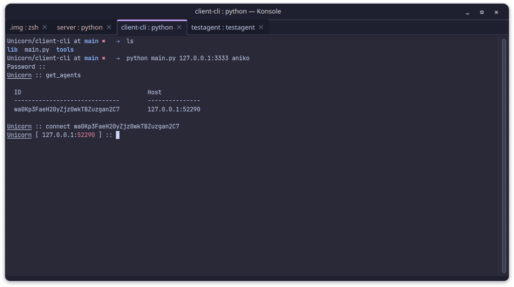
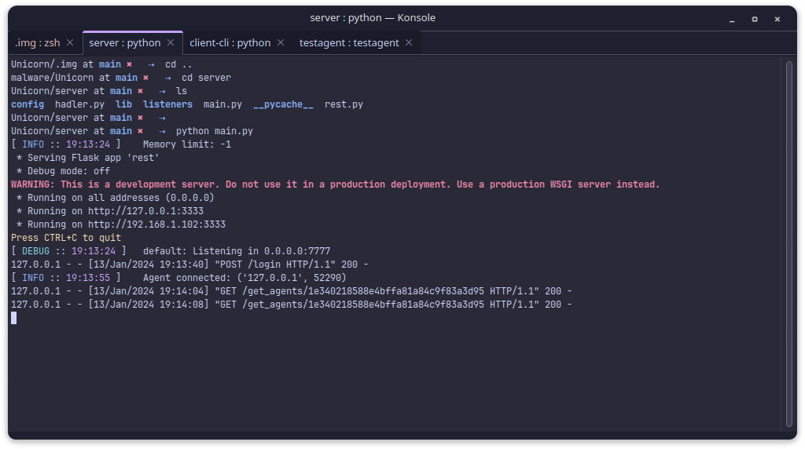

# Unicorn - C2 Framework
*C2 extensible for post-explotation and remote control*

Authors: [@aniko33](https://github.com/aniko33), [@UnityTheCoder](https://github.com/UnityTheCoder), [@anywayzz](https://github.com/anywayzz)

*Working in progress...*

### Client (CLI)

> Written in Python

### Server

> Written in Python using Flask

### Agent (DeltaAgent)

### TODO - Server
- [X] multiple listeners and dynamic addition
- [ ] low resource usage
- [ ] better "multi-player"
- [X] payload generation
- [ ] proxy server for pivoting
- [X] clients chat
- [ ] sync client chat
- [ ] remote tools

### TODO - Client (CLI - GUI)
- [ ] manage agents
- [X] sending commands
- [ ] inject shellcode
- [ ] local tools
- [X] clients chat
- [ ] dynamic command additon for GNU-readline
- [ ] more colorful and beautiful :3
- [ ] custom scripts
- [ ] GUI in Rust with Tauri

## Showcase
https://github.com/aniko33/Unicorn/assets/76649588/5752b2dc-367d-4751-b588-3141304cd1ca
