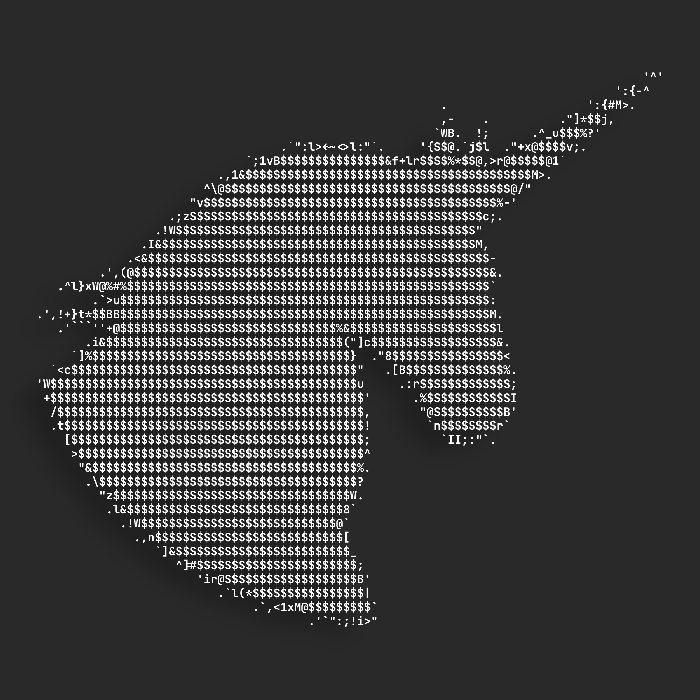
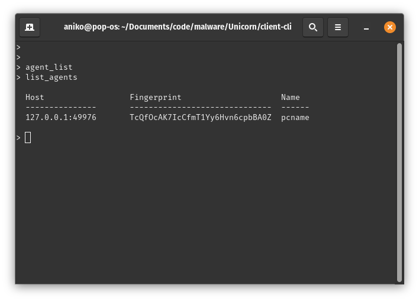
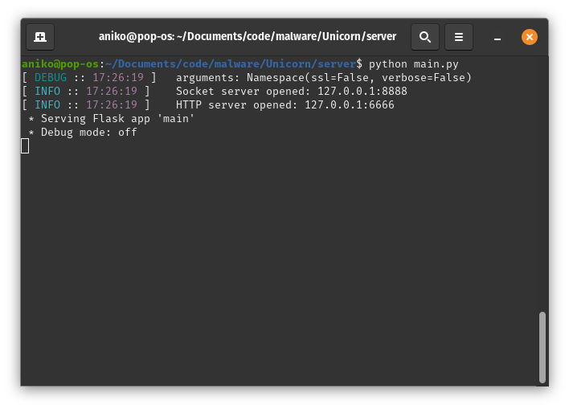

# Unicorn - C2 Framework
*C2 extensible for post-explotation and remote control*

Authors: [@aniko33](https://github.com/aniko33), [@UnityTheCoder](https://github.com/UnityTheCoder)

*Working in progress...*

### Client (CLI)

> Written in Python

### Server

> Written in Python using Flask & Asyncio

### Agent (DeltaAgent)

> Written in Rust

### TODO - Agent
- [ ] add commands
- [ ] clean code
- [ ] optimization

### TODO - Server
- [X] api server
- [X] enable https
- [ ] client connection
- [ ] connection with agents
- [ ] clients chat

### TODO - Client (CLI - GUI)
- [X] http client
- [X] server connection
- [ ] manage agents
- [ ] clients chat
